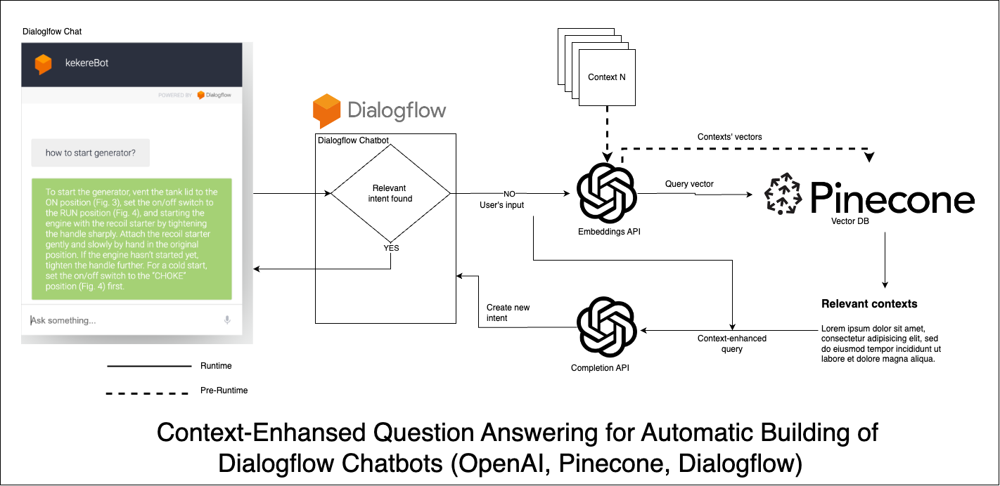

# Easybot #

Easybot is a pet project which allows to generate Dialogflow chatbots automatically using OpenAI-Pinecone stack (context-enhanced question answering). 



For more details, please __[Watch the video](https://youtu.be/BwoAp-imRqs)__  👀 📹
## Running the app ##
```
# clone the repo
git clone git@github.com:IuriiD/easybot.git
cd easybot

# to generate vectors and save them in Pinecone
cd embeddings
python3 -m venv env
source env/bin/activate
pip3 install -r requirements.txt

# put the information to be used as contexts as txt documents in /embeddings/contexts
# keep your context documents <1k tokens (see the usage of tiktoken package in the script)

# create keys.py (see keys_example.py) and provide your 
# OPENAI_KEY, OPENAI_ORG, PINECONE_API_KEY, PINECONE_INDEX_NAME
# run the script to generate and upload embeddings
python3 generate-upload-vectors.py

# to run the backend webhook app for the Dialogflow chatbot
# which will be creating new intents on Dialogflow:
# a) create an .env file (see .env.example) and provide your 
# OpenAI, Pinecone secrets, and also the credentials for your
# Google cloud project behind the Dialogflow agent used

# b) start the app
npm start

# c) if the app is run locally (vs e.g. on Heroku/AWS EC2 etc),
# expose your app using https://ngrok.com/ , https://github.com/localtunnel/localtunnel or
# analogues. Copy the publicly accessible URL returned and save it on
# Dialogflow in the Fullfillment section, having added "/webhook" at the eng, e.g. 
# https://spotty-zebras-stay-37-139-161-215.loca.lt/webhook

# d) enable and open the test Dialogflow test chat and send some question to the bot.
# Observe how backend is writing logs
```

## Running the app ##
This is a proof-of-concept (POC), created while learning OpenAI-Pinecone stack. The app is handling only the "happy flow" and might contain bugs.